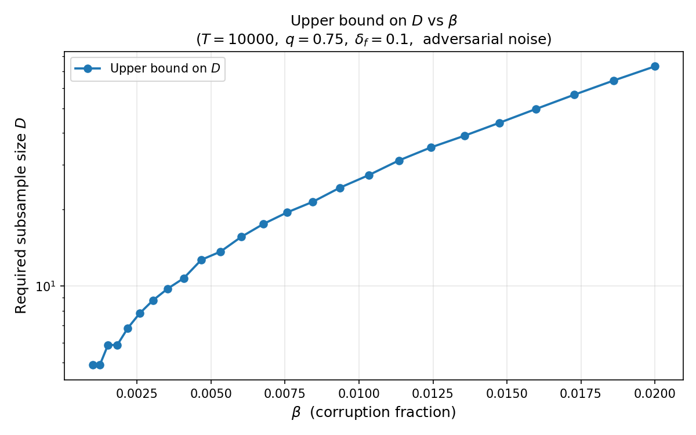

# Explicit beta and D in QRK

Minimal self-contained code (`adv_D_upper`) for computing the **upper bound on
the subsample size D** in Quantile-based Randomized Kaczmarz (QRK) under
**adversarial Massart noise** and **random noise**.

---

## Background

QRK solves a corrupted linear system Ax* + ε = b where ε is (βm)-sparse.
At each iteration it computes a q-quantile of the residual using a subsample
of D rows.  Our theory (preliminary result) shows that QRK linearly converges
over T iterations with high probability provided

```
D ≥ C · log(T) / log(1/β)
```

for some absolute constant C.  This code numerically finds the **smallest D**
satisfying the full set of feasibility conditions for given (β, T, q, δ_f).

---

## Package layout

```
adv_D_upper/
├── qrk_adv/
│   ├── divergence.py    # DKL(q || p) for Bernoulli distributions
│   ├── quantile.py      # half-normal quantile, sigma_min^2 lower bound
│   ├── noise.py         # fixed/Gaussian noise error increase utilities
│   ├── feasibility.py   # feasibility conditions (adversarial + variants)
│   ├── search.py        # find feasible (alpha_0, alpha') at fixed D
│   └── upper_bound.py   # binary search for smallest_D  ← main entry point
├── demo.py              # single example + sweep plot (adversarial by default)
├── requirements.txt
└── README.md
```

---

## Quick start

```bash
cd adv_D_upper
pip install numpy scipy matplotlib
python demo.py
```

This prints the smallest D for a single example and saves
`figure/demo_D_vs_beta.png` showing D vs beta.

## Demo figure



---

## Main API

```python
from qrk_adv.upper_bound import smallest_D

result = smallest_D(
    beta    = 0.05,    # corruption fraction
    T       = 20_000,  # number of iterations
    q       = 0.75,    # quantile level
    delta_f = 0.1,     # total failure probability budget
    D_max   = 500,     # search ceiling (raise if result hits it)
  c_target = 0.0,
    feasibility_check = None,  # defaults to adversarial check
)

print(result["smallest_D"])   # smallest feasible D
print(result["c"])             # net contraction coefficient c
print(result["failure_prob"])  # actual failure probability
```

### Parameters

| Name        | Type  | Meaning |
|-------------|-------|---------|
| `beta`      | float | Corruption fraction beta in (0, q) and (0, 1-q) |
| `T`         | int   | Number of QRK iterations |
| `q`         | float | Quantile level, e.g. 0.75 |
| `delta_f`   | float | Total failure probability budget |
| `D_max`     | int   | Search ceiling on D (default 500) |
| `D_precision`| float | Binary-search stopping tolerance (default 1) |
| `c_target`  | float | Require c ≥ c_target (default 0) |
| `feasibility_check` | callable | Optional check function (defaults to adversarial) |

### Return value

| Key            | Meaning |
|----------------|---------|
| `smallest_D`   | Smallest feasible D (None if infeasible within D_max) |
| `alpha_0`      | Optimal lower slack parameter |
| `alpha_prime`  | Optimal upper slack parameter |
| `c`            | Net contraction at optimum |
| `failure_prob` | Actual failure probability 1 - (1-p_u)^T |
| `hit_ceiling`  | True if result == D_max (increase D_max) |

---

## Feasibility conditions for adversarial case

The two conditions verified at each candidate D are:

1. **Net contraction** (c > 0):  
   `p_l_c = 1 - exp(-DKL(q, β+α₀) · D)`
   `Φ = half_normal_quantile(1 - α'/(1-β))`
   `c = (1-β)·p_l_c·σ_min²(α₀/(1-β)) - β·(Φ² + 2Φ·E|Z|) ≥ c_target`  

2. **Failure probability**:  
   `1 - (1 - β·exp(-DKL(1-q, β+α')·D))^T ≤ δ_f`

---

## Notes

- The default feasibility check is the preliminary adversarial analysis.
  You can pass a custom check via `feasibility_check` to use other models
  (e.g., fixed-noise or Gaussian worst-sigma variants added in
  `qrk_adv.feasibility`).
- Feasibility requires `β < min(q, 1-q)`.  Near this boundary D grows
  rapidly; increase `D_max` as needed.
- The `c_target` parameter can be used to study robustness: a larger
  c_target forces a faster convergence rate but raises the required D.

## Additional demos
- `demo.py` supports a `FEASIBILITY_CHECK` variable and a `VERBOSE` flag
  for printing sweep progress.